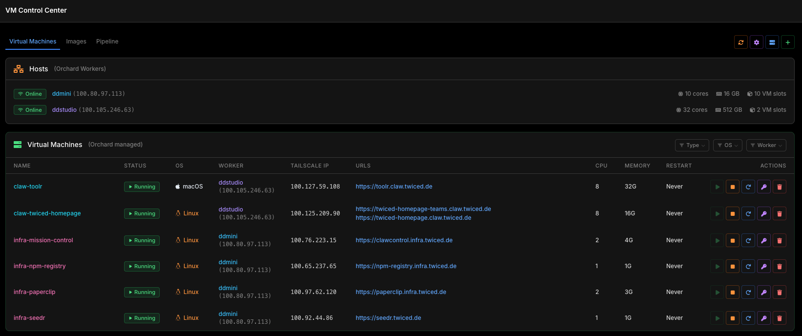

# VM Control Center

A web dashboard for managing [Orchard](https://github.com/cirruslabs/orchard)-orchestrated VMs and local [Tart](https://github.com/cirruslabs/tart) images on Apple Silicon Macs.



## Features

- **Virtual Machines** — View and manage all Orchard-managed VMs across multiple hosts. Start, stop, restart, and destroy VMs with real-time task logging via WebSocket.
- **Host Overview** — See all connected Orchard workers with CPU cores, memory, VM slot capacity, and Tailscale IPs.
- **Images** — Browse local Tart source images and cached OCI images. See which VMs are using each image.
- **Pipeline** — Monitor pipeline runs from the Pipeline Controller (develop → review → test → deploy lifecycle).
- **Service Discovery** — Automatically maps Caddy reverse-proxy routes to VMs via Tailscale, showing clickable URLs for each VM's services.
- **Agent Login** — Interactive login flow for coding agents (Claude Code, Codex, Gemini CLI, GitHub Copilot) running inside VMs, with OAuth proxy support.
- **VM Creation** — Create new VMs with custom CPU, memory, disk, and startup scripts. Generates prompts for provisioning.
- **Filtering** — Filter VMs by type (claw-\*/infra-\*), OS (macOS/Linux), or worker host.
- **GitHub Images** — Browse available Cirrus Labs macOS images from the GitHub Container Registry (requires optional GitHub token).
- **Real-time Updates** — Server-Sent Events push live VM status, host data, and image changes to all connected clients.
- **Responsive** — Works on desktop and mobile (table → card layout on small screens).

## Prerequisites

- macOS (Apple Silicon)
- Python 3.11+
- [Tart](https://github.com/cirruslabs/tart) installed
- [Orchard](https://github.com/cirruslabs/orchard) controller reachable (configured via `~/.orchard/orchard.yml`)
- [Tailscale](https://tailscale.com/) for cross-host networking and IP resolution

## Quick Start

```bash
# Install dependencies
make install

# Start development server (localhost:8000, hot-reload)
make dev
```

Open [http://localhost:8000](http://localhost:8000) in your browser.

## Production

```bash
source venv/bin/activate
uvicorn tartvm.main:app --host 0.0.0.0 --port 8200
```

On first start, an API token is generated at `~/.vm-control-center/token`. The UI injects this token automatically — no manual auth needed in the browser.

## Configuration

Copy the example environment file and adjust for your deployment:

```bash
cp .env.example .env
```

All settings use the `VMCC_` environment variable prefix (via [pydantic-settings](https://docs.pydantic.dev/latest/concepts/pydantic_settings/)). Set them in `.env` or export directly.

| Variable | Default | Description |
|----------|---------|-------------|
| `VMCC_HOST` | `127.0.0.1` | Bind address |
| `VMCC_PORT` | `8000` | Bind port |
| `VMCC_DEBUG` | `false` | Debug mode |
| `VMCC_TART_PATH` | `tart` | Path to local Tart binary |
| `VMCC_ORCHARD_TIMEOUT` | `30` | Orchard API timeout (seconds) |
| `VMCC_SSH_KEY` | *(none)* | SSH private key for remote worker access |
| `VMCC_SSH_USER` | `admin` | SSH user on remote workers |
| `VMCC_REMOTE_TART_PATH` | `/opt/homebrew/bin/tart` | Path to Tart binary on remote workers |

### Orchard Connection

Orchard credentials are loaded automatically from `~/.orchard/orchard.yml` (the same config file used by the `orchard` CLI). No additional setup is needed if you already have Orchard configured.

You can also set them explicitly:

| Variable | Description |
|----------|-------------|
| `VMCC_ORCHARD_URL` | Orchard controller URL |
| `VMCC_ORCHARD_USER` | Orchard service account name |
| `VMCC_ORCHARD_TOKEN` | Orchard service account token |

### GitHub Token (Optional)

To browse available macOS images from Cirrus Labs:

1. Create a GitHub personal access token with `read:packages` scope at [github.com/settings/tokens](https://github.com/settings/tokens)
2. Configure via the Settings modal in the UI, or manually:
   ```bash
   mkdir -p ~/.vm-control-center
   echo "ghp_your_token" > ~/.vm-control-center/github_token
   chmod 600 ~/.vm-control-center/github_token
   ```

## Architecture

- **Backend**: [FastAPI](https://fastapi.tiangolo.com/) with async Orchard API client, SSE for real-time updates, WebSocket for task logs and agent login
- **Frontend**: Vanilla JS + [Tailwind CSS](https://tailwindcss.com/) with a custom dark theme
- **VM Management**: Proxies to [Orchard](https://github.com/cirruslabs/orchard) API for VM lifecycle (create, start, stop, destroy)
- **Image Management**: Queries local [Tart](https://github.com/cirruslabs/tart) for source images and OCI cache
- **Service Discovery**: Queries Caddy admin API + Tailscale status to map reverse-proxy routes to VMs
- **Pipeline**: Proxies to a Pipeline Controller service for development pipeline monitoring

## API

See [API.md](./API.md) for endpoint documentation.

## Security

- API token auto-generated on first run, stored at `~/.vm-control-center/token` (mode `0600`)
- All API endpoints require `X-Local-Token` header (injected automatically in the browser)
- GitHub token stored at `~/.vm-control-center/github_token` (mode `0600`)
- No credentials are ever stored in the codebase
- CORS restricted to `localhost` and `*.twiced.de`

## License

[MIT](./LICENSE) — TwiceD Technology GmbH
